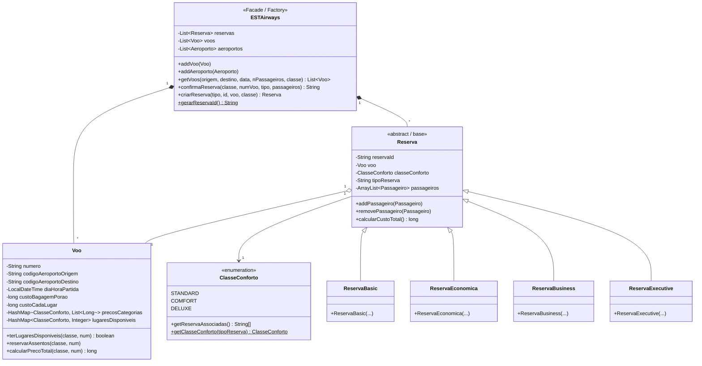

# ✈️ TP1: EST Global Airways — Sistema de Reservas e Gestão de Voos

<div align="center">


<p align="center">
  <b>Sistema desktop de gestão de tráfego aéreo e bilhética, suportado por classes de conforto diferenciadas, parsing estruturado de datasets e arquitetura desacoplada via padrões GoF.</b>
</p>

</div>

---

## 📋 Descrição do Domínio

A **EST Global Airways** é uma companhia aérea fictícia com hub operacional situado no Aeródromo Municipal de Castelo Branco. A aplicação gere rotas, disponibilidade de inventário em cabine, tarifários variáveis, franquias de bagagem e o ciclo de vida completo de cada bilhete emitido.

### Formato dos Ficheiros de Dados (`data/`)

#### 1. Ficheiro de Aeroportos (`aeroportos.dat`)
Ficheiro de texto delimitado por tabulações (`\t`), onde cada linha define um aeroporto:
```tsv
<Código_IATA>	<Nome_Aeroporto>	<Taxa_Aeroportuária>	<Taxa_Alterações>
LIS	Aeroporto Humberto Delgado Lisboa	45	20
OPO	Aeroporto Francisco Sá Carneiro Porto	40	15
CBR	Aeródromo Municipal de Castelo Branco	10	5
```

#### 2. Ficheiro de Voos (`voos.dat`)
Ficheiro estruturado por blocos de voo, iniciando com o marcador `<-- VOO -->`:
```text
<-- VOO -->
<Número_Voo>
<Código_Origem>
<Código_Destino>
<Hora_Partida> (formato H:m)
<Custo_Base_Lugar>
<Custo_Bagagem_Porão>
<Preço_Deluxe> <Preço_Comfort> <Preço_Standard>
<Lotação_Deluxe> <Lotação_Comfort> <Lotação_Standard>
```

---

## 🏛️ Padrões de Desenho & Decisões Arquiteturais



### Explicação dos Padrões
1. **Facade (`ESTAirways`):** Oferece à camada de interface gráfica uma API unificada e simplificada de alto nível, ocultando a complexidade de validação de lotações, cálculo de preços acumulados e gestão das coleções internas.
2. **Factory Method (`ESTAirways.criarReserva`):** Encapsula a criação das especializações da reserva com base numa *string* identificadora ou seleção de menu, desacoplando o cliente Swing das classes concretas (`ReservaBasic`, `ReservaEconomica`, etc.).
3. **Especialização Polimórfica:** Permite implementar comportamentos e restrições contratuais por tipo de reserva (direito a bagagem incluída, custos de alteração de bilhete e regras de cancelamento).

---

## 🖥️ Camada de Apresentação (Java Swing)

* **`JanelaEscolha`:** Filtro dinâmico de pesquisa de voos (aeroporto de partida, chegada, data e número de bilhetes), integrando ordenações personalizadas.
* **`JanelaReservas`:** Painel de consulta por código de reserva alfanumérico (6 carateres), edição de nomes de passageiros, marcação de assentos e despacho de bagagens de porão.
* **`JanelaVoos`:** Painel informativo exibindo a capacidade total e lugares remanescentes discriminados pelas três classes de conforto.
* **`VooReservarDialog`:** Modal de checkout que formaliza o registo dos dados dos passageiros.

---

## ⚡ Como Executar

A partir da pasta `TP1_ESTGlobalAirways`:

```bash
# Compilar todas as classes para a pasta bin
javac -d bin -sourcepath src src/estairways/*.java src/menu/*.java

# Executar a aplicação
java -cp bin menu.Main
```

> [!NOTE]
> No ficheiro `src/menu/Main.java`, caso necessário, garanta que os caminhos para `aeroportos.dat` e `voos.dat` apontam para o diretório relativo `data/aeroportos.dat` e `data/voos.dat`.
