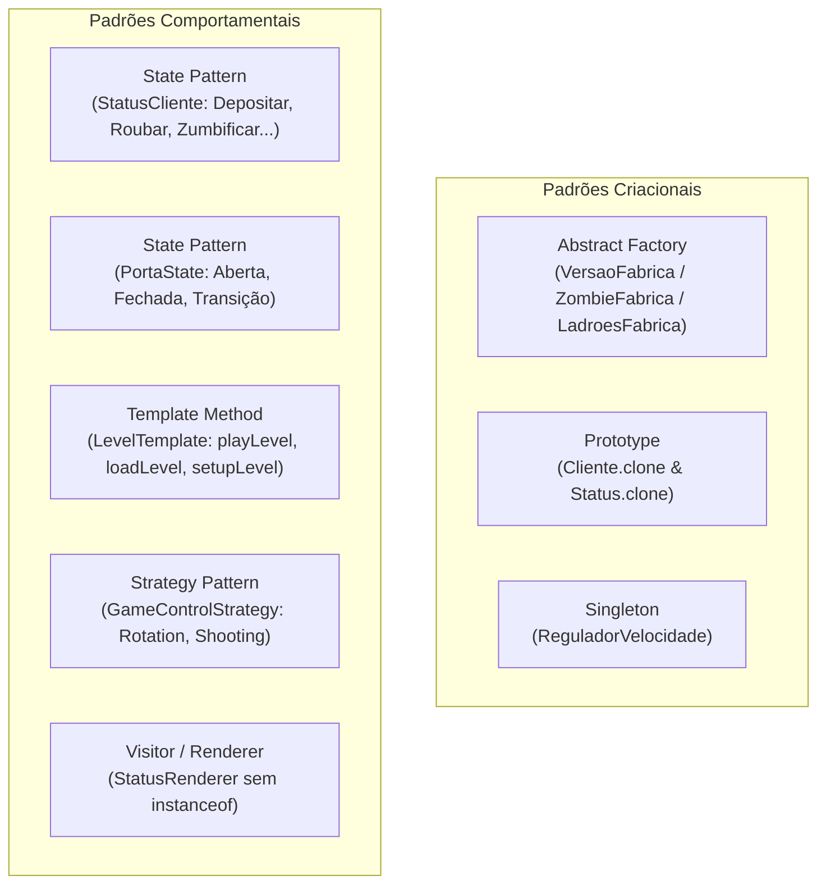

# 🤠 TP2: Banco do FaroEST — Expansion Packs (Refactoring & Design Patterns)

<div align="center">


<p align="center">
  <b>Reengenharia arquitetural e introdução de Packs de Expansão num jogo arcade 2D em Java Swing através da aplicação de State, Prototype, Abstract Factory, Template Method, Strategy e Singleton.</b>
</p>

</div>

---

## 🎯 Visão Geral & Problemas do Código Legado

O **Banco do FaroEST** é um jogo arcade onde o jogador encarna um segurança que vigia 3 portas em simultâneo. Às portas chegam clientes que depositam dinheiro, assaltantes armados, clientes para trocas e clientes impacientes.

### Code Smells Identificados na Versão Base:
* ❌ **Monolitos com `switch/case`:** Seleção de packs de jogo e tipos de cliente codificados através de inteiros mágicos e estruturas `switch` espalhadas pelo código.
* ❌ **Acoplamento Extremo na Classe `Porta`:** Lógica de comportamento da porta misturada com ifs dependentes do estado do cliente.
* ❌ **Violação do Princípio Open/Closed (OCP) com `instanceof`:** A interface gráfica de status inspecionava os clientes com cadeias sucessivas de `if (cliente.getStatus() instanceof StatusDepositar)`.
* ❌ **Variáveis Estáticas Globais:** O controlo temporal e a velocidade do jogo estavam acoplados estaticamente a variáveis da classe principal `BancoFaroEst`.

---

## 🧩 Soluções de Engenharia e Padrões Aplicados



---

### 1. State Pattern — Comportamento dos Clientes e das Portas
* **Clientes (`StatusCliente`):** A máquina de estados gere transições dinâmicas entre estados como `StatusDepositar`, `StatusRoubar`, `StatusTrocando`, `StatusTemporal`, `StatusTerminal` e `StatusInativo`.
* **Portas (`PortaState`):** A classe `Porta` delegou todo o processamento de cliques e temporizações para instâncias polimórficas de estado (`FechadaState`, `AbertaState`, etc.), eliminando todos os blocos `switch(estadoPorta)`.

### 2. Prototype Pattern — Clonagem Profunda de Níveis e Clientes
* A classe `Cliente` implementa `Cloneable`.
* Para permitir carregar configurações de nível pré-fabricadas sem reprocessar ficheiros nem instanciar árvores complexas do zero, a operação `cliente.clone()` clona em profundidade as imagens visuais, a lista de extras e o próprio estado interno:
  ```java
  Cliente v = (Cliente) super.clone();
  v.statusAtual = statusAtual.clone();
  v.statusAtual.ativar(v);
  ```

### 3. Abstract Factory — Desacoplamento dos Packs de Expansão
* Foi criada a interface `VersaoFabrica`, permitindo que novos packs sejam adicionados sem modificar o ciclo de jogo principal:
  * `BaseFabrica` $\rightarrow$ Versão clássica do banco.
  * `ZombieFabrica` $\rightarrow$ **Pack Zombies:** Clientes abatidos tornam-se mortos-vivos agressivos com contagem decrescente para ataque.
  * `LadroesFabrica` $\rightarrow$ **Pack Todos Roubam:** Clientes após o depósito tentam furtar os fundos da porta caso o jogador não atue a tempo.

### 4. Eliminação de `instanceof` com Polimorfismo / Renderer
* Na janela de status (`JanelaStatus`), a inspeção visual e renderização do grafo de estados (GraphStream) era realizada via `instanceof`.
* Foi introduzida a interface `StatusRenderer` / método polimórfico no próprio estado, onde cada objeto de estado sabe desenhar o seu próprio nó e arestas no grafo, respeitando plenamente o princípio OCP.

### 5. Singleton Pattern — Controlo de Velocidade Centralizado
* Criação de `ReguladorVelocidade.getInstance()` como Singleton thread-safe, eliminando o acoplamento estático a `BancoFaroEst` e facilitando a calibração da velocidade de jogo e pausas de forma limpa.

### 6. Template Method — Ciclo de Vida dos Níveis
* A classe abstrata `LevelTemplate` define o esqueleto invariante do algoritmo de carregamento:
  ```java
  public void playLevel(int nivel, int pack) throws IOException {
      loadLevel(nivel, pack);
      setupLevel();
      startLevel();
  }
  ```

### 7. Strategy Pattern — Controlo e Interações do Jogador
* `GameControlStrategy` com especializações `RotationControlStrategy` e `ShootingControlStrategy`, orquestradas por `GameControlContext`.

---

## 📊 Diagramas de Padrões de Desenho

Os diagramas de suporte aos padrões implementados encontram-se salvaguardados em [`docs/diagrams/`](../docs/diagrams/):
* `diagrama de classes.jpeg` — Visão geral da arquitetura de classes.
* `prototype.png` — Modelação do padrão Prototype em `Cliente`.
* `strategy.png` — Modelação do padrão Strategy para controlo de inputs.
* `template.png` — Modelação do Template Method em `LevelTemplate`.
* `visitor.png` — Modelação do desacoplamento da renderização de status.

---

## ⚡ Como Executar

A partir da pasta `TP2_BancoFaroEST`:

### Compilação com Bibliotecas GraphStream:
```bash
# Criar diretório de saída
mkdir -p bin

# Compilar incluindo os JARs de dependência
javac -cp "lib/gs-core-2.0.jar;lib/gs-ui-swing-2.0.jar;src" -d bin src/faroest/app/*.java src/faroest/cliente/*.java src/faroest/mundo/*.java src/faroest/util/*.java src/prof/jogos2D/**/*.java
```

### Execução:
```bash
java -cp "bin;lib/gs-core-2.0.jar;lib/gs-ui-swing-2.0.jar" faroest.app.BancoFaroEst
```
